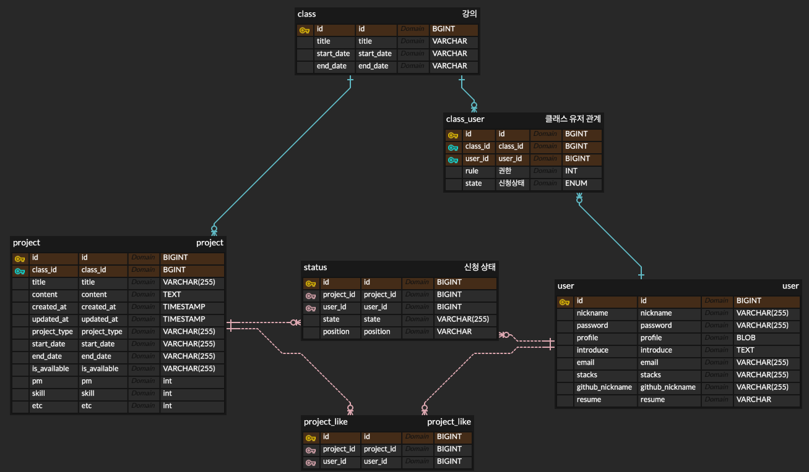

# A3.1 OSS 프로젝트 최종보고서

## I. 프로젝트 수행팀 개요

* 수행 학기: 2024년 1학기
* 프로젝트명: TeamEasy - 동국대학생들을 위한 팀 매칭 서비스   
* Key Words :  
    * 팀매칭
    * 동국대학교
    * 이력서
    * 팀프로젝트
    * 팀원모집
  
* 팀명: DevOops

| 구분 |  성명  |    학번    |     소속학과     |    연계전공    |        이메일        |
|:----:|:------:|:----------:|:----------------:|:--------------:|:--------------------:|
| 팀장 | 천기정 | 2019112471 | 산업시스템공학과 | 융합소프트웨어 | pridess@dongguk.edu  |
| 팀원 | 김동완 | 2020113297 | 통계학과         | 융합소프트웨어 | wandong97@dgu.ac.kr  |
| 팀원 | 김호정 | 2020111556 | 경영정보학과     | 융합소프트웨어 | 2020111556@dgu.ac.kr |  

* 지도교수: 이길섭 교수님, 박효순 교수님 
 

## II. 프로젝트  수행 결과

### 1. 프로젝트 개요 

- 주제:
    - 동국대학교 학생들을 위한 팀 매칭 서비스
    - 동국대학교 학생들만 이용 가능하며, 여러 공모전이나 강의 팀프로젝트를 함께할 팀원들을 쉽게 구할 수 있게 해주는 서비스
- 동기:
    - 오픈소스소프트웨어 실습과 프로젝트에서 겪었던 팀원 매칭의 불편함으로부터 시작함
    - 팀원들의 이력서를 보고 쉽게 연결이 가능하며 팀 매칭 현황을 간편하게 확인 가능하게 하고자 함
    -  이를 넘어서 교내와 교외의 여러 공모전 과 프로젝트에 쉽게 팀을 매칭할 수 있는 서비스를 개발함

#### 1.1 개발 동기 및 목적  

- 팀 강의에서 발생하는 문제: 팀원의 구성

  - 팀원 찾기의 어려움: 수강생들이 원하는 팀원을 직접 찾으려면, 중복되는 경우가 많고, 연락한 팀원이 답을 주지 않으면 기다려야 하는 불편함이 있음
  - 혼란스러운 팀 구성: 시간이 지날수록 팀 구성이 완료된 수강생이 많아져, 팀을 구성하려는 수강생들은 더욱 혼란을 겪게 됨
  - 실시간 팀 구성 확인: 이러한 불편을 해소하고자, 팀 구성을 실시간으로 확인하고 명확히 분야를 설정할 수 있도록 하는 서비스가 필요함

- 굳어가는 팀 구성과 이에 따른 문제점

	- 친숙한 팀 구성: 많은 학생들이 새로운 사람보다는 평소 친한 사람들과 팀을 구성하는 경향이 있음
	- 소통의 장점과 단점: 친한 사람들과 함께 프로젝트를 진행하면 소통이 원활하지만, 의견이 한 방향으로 굳어질 수 있는 단점이 있음
	- 다양한 경험의 필요성: 다양한 분야의 사람들과 소통하며 새로운 경험을 쌓을 수 있도록 돕는 서비스가 필요함

- 결론

	- 능력 발휘와 소통의 장: 동국대학교 학생들이 자신의 능력을 최대한 발휘하고, 다양한 사람들과 소통하며 새로운 경험을 할 수 있도록 돕고자 함
    - TeamEasy는 이러한 문제를 해결하기 위해 설계된 서비스임
    - 이 서비스를 통해 학생들은 보다 효율적으로 팀을 구성하고, 다양한 배경의 사람들과 협력하여 더 나은 학습 경험을 누릴 수 있음

#### 1.2 필요성  

1.	효율적인 팀 구성:
-  시간 절약: 수강생들이 팀원을 직접 찾는 과정에서 많은 시간이 소요되며, 답변을 기다리는 동안 불확실성이 커짐. TeamEasy는 실시간으로 팀 구성을 확인하고, 신속하게 팀원을 찾을 수 있도록 하여 시간 절약을 도와줌.
- 정확도: 학생들이 자신과 잘 맞는 팀원을 찾기 어려운 경우가 많음. TeamEasy는 학생들의 이력서와 관심 분야를 기반으로 적합한 팀원을 추천하여 매칭의 정확도를 높임
2. 다양성과 협업 증진:
-  경험: 많은 학생들이 익숙한 친구들과 팀을 구성하지만, 이는 제한된 경험과 시각을 가져올 수 있음. 다양한 배경을 가진 학생들과의 협업을 통해 새로운 아이디어와 창의적인 해결책을 도출할 수 있음
- 통합적 학습: 서로 다른 전공과 배경을 가진 학생들이 협력하여 프로젝트를 진행함으로써, 통합적이고 다각적인 학습 경험을 제공할 수 있음
3.	팀 빌딩의 체계화:
- 혼란 감소: 프로젝트나 공모전을 준비하는 과정에서 발생하는 혼란을 줄이고, 체계적인 팀 빌딩 과정을 제공하여 학생들의 스트레스를 줄임
- 실시간 상태 확인: 팀 매칭 현황을 실시간으로 확인할 수 있어, 팀 구성 과정에서 발생하는 불편함을 최소화함
4.	향상된 프로젝트 질:
- 능력 발휘: 적합한 팀원을 찾고 구성함으로써 학생들이 자신의 능력을 최대한 발휘할 수 있습니다. 이는 프로젝트의 전체적인 질을 향상시킴
- 경쟁력 강화: 동국대학교 학생들이 참여하는 공모전과 프로젝트의 경쟁력을 강화하고, 더 나은 성과를 도출할 수 있음
5.	교수님과 학생들의 만족도 향상:
- 교수님의 부담 경감: 교수님들은 학생들의 팀 빌딩 과정을 실시간으로 모니터링하고 관리할 수 있어, 팀 구성에 대한 고민을 덜 수 있음
- 학생 만족도 증대: 학생들은 더 나은 팀원과 함께 프로젝트를 진행할 수 있어, 학업 만족도가 높아짐


#### 1.3 개발 목표  

동국대학교 학생들을 위한 웹 기반 공모전 및 강의 팀 빌딩 시스템
1. 사용자에게 직관적인 인터페이스를 제공, 팀 빌딩과 프로젝트 관리 과정을 간소화하여 편리함을 제공함으로써 사용자 경험을 강화
2. 학생들에게 타학과 학생들과 교류할 수 있는 서비스를 통해 다양하고 새로운 프로젝트를 진행할 수 있게 효율적인 팀 구성의 기회를 제공
3. 교수님들께 수업 별로 팀 빌딩 과정 및 결과를 실시간으로 제공하여 학생들의 팀 빌딩에 대한 피로도를 감소
4. 동국대학교 이메일을 통한 회원가입 기능을 통해 사용자의 신뢰성을 보장하여 사용자들이 보다 적극적으로 공모전 및 프로젝트에 참여할 수 있게 도움
5. 학생들의 이력서를 통해 자신의 능력을 효과적으로 표현할 수 있도록 도와주어 팀원들이 적합한 팀원을 찾을 수 있도록 도움
6. 학생들이 원하는 프로젝트를 등록하고, 다른 학생들이 참여할 수 있도록 도와주어 학생들이 원하는 프로젝트를 진행할 수 있도록 도움


### 2. 최종결과물 소개  

1. 이력서 작성 페이지

   - 학생들은 자신의 이력서를 작성하고, 이를 다른 학생들이 볼 수 있도록 공개할 수 있음
   - 마크다운 형식을 이용하여 자신이 원하는 형식의 이력서를 작성 가능
   - 마크다운이 익숙하지 않은 유저들을 위한 프리뷰 에디터를 제공하여 보다 쉽게 이력서를 작성할 수 있도록 도움
2. 동국대학교 강의 페이지

   - 교수님은 강의를 등록하고, 학생들은 해당 강의에 참여하여 팀을 구성할 수 있음
   - 강의에 대한 정보와 팀 구성 현황을 확인할 수 있음
   - 강의에 참여 중인 학생들과 이력서를 확인할 수 있음
   - 학생들의 팀 구성 현황을 확인 가능
3. 동국대학교 강의 팀구성 페이지

   - 학생들은 강의 내에서 자유롭게 팀을 구성할 수 있음
   - 팀원을 찾는 학생들은 자신의 이력서를 등록하고, 다른 학생들의 이력서를 확인하여 적합한 팀원을 찾을 수 있음
   - 가입 상태를 바로 확인 가능
4. 동국대학교 팀 매칭 페이지

   - 학생들은 자신이 원하는 프로젝트를 등록하고, 다른 학생들이 참여할 수 있도록 도움
   - 원하는 프로젝트의 형식에 맞춰 팀 구성을 변환할 수 있음
   - 팀장은 자신의 이력서와 프로젝트에 대한 정보를 등록할 수 있음
   - 팀원은 자신의 이력서를 통해 가입을 신청할 수 있음
### 3. 프로젝트 추진 내용    


#### 3.1 프로젝트 진행과정    

1. 초기 아이디어 도출
   - 문제 인식: 팀 구성의 어려움과 이에 따른 문제점을 파악
   - 아이디어 도출: 팀 구성의 어려움을 해결할 수 있는 서비스를 개발하기로 결정
2. 기획
   - 기능 명세: 이력서 작성, 팀 프로젝트 등 필요한 기능을 명세
   - UI/UX 설계: 사용자가 편리하게 서비스를 이용할 수 있도록 UI/UX 설계
   - 데이터베이스 설계: 사용자 정보, 프로젝트 정보 등을 저장할 데이터베이스 설계
3. 기초 설계
   - 백엔드 설계: 서비스를 구동하기 위한 데이터베이스 및 API 설계
   - 프론트엔드 설계: 사용자 인터페이스 및 사용자 경험을 최적화하기 위한 설계
4. 구현 단계
   - 충돌을 방지하기 위해 브랜치를 분리하여 개발
   - 프론트엔드: main 브랜치 이용
   - 백엔드: 기능을 분할하여 각자 브랜치에서 개발(chun,hojeong)
   - 이후 통합하여 테스트
5. 이슈 처리
   ### 이슈 처리

1. **백엔드 JSON 역직렬화 오류:**
    - **문제:** JSON 데이터를 객체로 변환하는 과정에서 발생하는 오류
    - **해결:** 객체 간의 양방향 참조를 제거하고, `@JsonManagedReference`와 `@JsonBackReference`를 사용하여 순환 참조 문제를 해결.

2. **팀 매칭 API 에러:**
    - **문제:** 팀 매칭 기능에서 API 호출 시 발생하는 에러
    - **해결:** API 명세를 수정하고, 필수 파라미터 및 데이터 검증 로직 추가.

3. **프론트엔드 상태 관리 문제:**
    - **문제:** 여러 컴포넌트 간의 상태 동기화 문제
    - **해결:** Redux를 도입하여 전역 상태 관리를 구현하고, 필요한 액션과 리듀서를 작성하여 상태 일관성 유지.

4. **데이터베이스 연결 오류:**
    - **문제:** 배포 환경에서 데이터베이스 연결 실패
    - **해결:** 환경 변수를 재설정하고, 보안 설정을 조정하여 데이터베이스 연결 문제를 해결.

5. **UI/UX 개선 요청:**
    - **문제:** 사용자 피드백을 반영한 UI/UX 개선 필요
    - **해결:** 디자인 팀과 협력하여 사용자 인터페이스를 개선하고, 테스트를 통해 사용자 경험을 향상시킴.

-  관련 이슈 링크
  - [GitHub 이슈 목록](https://github.com/CSID-DGU/2024-1-OSSProj-DevOops-02/issues?q=is%3Aissue+is%3Aclosed)

#### 3.2 프로젝트 구현과정

0. 기존 서비스 레포지토리 사용

   |                               | TeamEasy | 티밍 | 비긴메이트 | 홀라 |
       |-------------------------------|----------|------|------------|------|
   | 실시간 팀 매칭 상황 확인 가능 |     O    |   X  |      X     |   X  |
   | 비개발자 이용 가능            |     O    |   X  |      O     |   X  |
   | 가입자 보안성                 |     O    |   X  |      X     |   X  |
   | 플랫폼 내 이력서 기능         |     O    |   X  |      O     |   X  |
   | 추천 시스템                   |     X    |   O  |      X     |   X  |

   - 문제점 분석: 위 표를 통해 기존 서비스의 문제점을 파악하고, 이를 해결할 수 있는 서비스를 개발
   - 기능 확장: 기존의 개발 중심 서비스를 공모전 전체로 확장, 팀 프로젝트 및 이력서 기능 추가.
   - 기존 서비스: 주로 개발 중심 서비스 제공.
   - 본 프로젝트: 공모전 전체로 서비스 확장, 마크다운 기반 이력서 작성 및 팀 프로젝트 기능 추가, 동국대학교 강의에서 활용 가능.

1. 초기 기능 설계

   - 기능 설계: 기존 레퍼런스를 기반으로 문제점을 해결하고 추가 기능을 설계.
   - 이력서 기능: 마크다운을 통해 이력서를 작성하고 다른 사용자와 공유 가능.
   - 팀 프로젝트 기능: 동국대학교 강의에서 팀 프로젝트를 진행할 수 있도록 확장.

2. 프론트엔드 개발

   - 디자인 및 구조: 기존 레퍼런스 디자인과 디렉토리 구조를 기반으로 필요한 페이지 레이아웃을 설계
   - 구현: React.js 등을 사용하여 사용자 인터페이스(UI) 및 사용자 경험(UX)을 최적화하여 개발
   - 기능 추가: 이력서 작성, 팀 프로젝트 관리 등 추가 기능 구현

3. 백엔드 개발

\<ERD>

\<API 명세>
   - 엔티티 설계: 필요한 데이터 모델을 설계하고 ERD(Entity Relationship Diagram)를 작성
   - API 명세: 프론트엔드와 협력하여 API 명세 작성
   - 구현: 스프링 부트를 사용하여 백엔드 서버 개발, 주요 기능 구현 및 데이터베이스 연동
   - 주요 기능: 사용자 관리, 프로젝트 생성 및 관리, 팀 매칭 기능 등

   5. 배포
      - 프론트 배포 (AWS Amplify를 이용한 배포)
       1. 설치 및 설정
          - AWS Amplify 설정: AWS 콘솔에서 Amplify를 설정하여 프로젝트를 생성하고 GitHub 리포지토리를 연결
          - 기본 명령어: amplify init 명령어를 통해 프로젝트를 초기화하고 설정을 완료
       2. React 프로젝트 배포
          - Build 설정: Amplify 콘솔에서 빌드 설정을 통해 React 프로젝트의 빌드 명령어와 배포 경로를 지정
          - 자동 배포: GitHub와 연동하여 코드를 푸시할 때마다 자동으로 빌드 및 배포가 진행되도록 설정
       3. 배포 중 발생한 문제 및 해결
          - React 18과 toast-ui의 버전 호환 문제
          - 문제 해결 과정: React 17로 다운그레이드, 사용하지 않는 변수 삭제 등 여러 시도를 통해 호환성 문제를 해결
          - 최종 해결: 필요 없는 변수를 제거하고, React 17 환경에서 정상적으로 동작하도록 수정
       - 자세한 배포 과정 및 문제 해결 방법
         - <a href="https://velog.io/@naninaniyoyoyoyo/AWS-Amplify%EB%A1%9C-%EB%A6%AC%EC%95%A1%ED%8A%B8-%EB%B0%B0%ED%8F%AC-GitHub-Repository-%ED%99%9C%EC%9A%A9">Amplify로 리액트 배포 (GitHub Repository 활용)</a>
         - <a href ="https://velog.io/@naninaniyoyoyoyo/React-AWS-Amplify-%EB%B0%B0%ED%8F%AC-%EA%B3%BC%EC%A0%95-%EC%A4%91-%EC%97%90%EB%9F%AC-%ED%95%B4%EA%B2%B0">React AWS Amplify 배포 과정 중 에러 해결</a>
       - 백엔드 배포 (AWS EC2를 이용한 배포)
         1.	Jib 의존성 추가
            - build.gradle 파일에 Jib 플러그인 추가 및 설정.
            - 명령어: ./gradlew jib 실행하여 Docker 이미지를 빌드하고 Docker Hub에 푸시.
         2. docker-compose.yml 파일 생성
            ```yaml
            version: "3.9"
            services:
            backend:
            image: "[docker hub 이름]/[어플리케이션 이름]:latest"
            ports:
              - "80:8080"
            restart: "always"
            ```
         3.	Elastic Beanstalk 설정
            - 애플리케이션 생성: Elastic Beanstalk 콘솔에서 애플리케이션 생성
            - 환경 구성: Docker 플랫폼 선택
            - IAM 역할 생성: EC2와 Elastic Beanstalk 관련 역할 생성 및 필요한 정책 추가
            - 구성 수정: 생성한 IAM 역할을 Elastic Beanstalk 환경에 할당
            - 배포: Elastic Beanstalk 콘솔에서 docker-compose.yml 파일을 업로드하여 애플리케이션 배포
         4. 문제 해결 및 배포 과정 
            - IAM 역할 및 정책 설정 문제 해결
            - Docker 이미지 빌드 및 푸시 과정에서 발생할 수 있는 에러 해결
            - Elastic Beanstalk 환경 구성 및 배포 과정에서 발생할 수 있는 문제 해결
         - 자세한 배포 과정 및 문제 해결 방법
           - <a href="https://velog.io/@naninaniyoyoyoyo/AWS-Elastic-Beanstalk-%EB%B0%B0%ED%8F%AC-%EA%B3%BC%EC%A0%95-%EC%A4%91-%EC%97%90%EB%9F%AC-%ED%95%B4%EA%B2%B0">AWS Elastic Beanstalk 배포 과정 중 에러 해결</a>
6. 수행계획, 중간발표 내용 중 최종적으로 적용된 내용

	- 초기 설계: 기능 설계 및 문제점 분석을 통해 초기 기획
	- 중간발표: 중간 진행 상황을 공유하고 피드백을 반영하여 최종 구현 계획 수정. 백엔드, 프론트엔드 개발 완료
	- 최종 적용: 백엔드 프론트엔드 배포 진행 후 api 연동, 테스트를 통해 버그 수정 

7. 구현 결과 요약
   1. 프론트엔드:
      - 마크다운 에디터: 사용자가 이력서를 작성 및 편집 가능
      - 팀 매칭 페이지: 실시간 데이터베이스 연동으로 팀 구성 현황 확인 및 관리 가능

   2. 백엔드:
       - API 설계 및 구현: 사용자 관리, 프로젝트 생성 및 관리, 팀 매칭 기능을 지원하는 RESTful API
       - 데이터베이스 연동: ERD를 기반으로 데이터 모델 설계 및 MySQL 연동

9. 제한 사항
   - 보안: 사용자 정보 보호를 위해 보안 강화 필요
   - 성능: 개인 서버를 사용하여 성능이 떨어질 수 있음
   - 기능: 짧은 기간과 인력으로 인해 서비스 출시는 아직 미흡
   
10. 향후 계획
   - 추가 기능: 채팅 기능, 팀 프로젝트 관리 기능 등 추가 기능 구현
   - 성능 개선: 서버 성능 개선 및 보안 강화
   - 사용자 피드백: 사용자 피드백을 수집하여 서비스 개선
   - 학교와 협력: 동국대학교와 협력하여 학교 내에서 서비스 활용 가능하도록 함

#### 4. 기대효과

- 팀 구성 프로젝트를 하는 학생:
    - 효율적인 팀 구성: 오픈소스 프로젝트 및 여러 캡스톤 프로젝트는 팀 단위로 진행됨. 하지만 이외 강의들은 랜덤 지정이나 자유 구성 방식을 통해 진행됨. 이러한 방식은 팀 구성에 있어 비효율적일 수 있음. TeamEasy 서비스를 통해 학생들은 자신의 프로젝트에 적합한 팀원을 빠르고 쉽게 찾을 수 있어 팀 구성의 효율성이 높아짐.
    - 개개인의 능력 발휘: 랜덤 팀 구성 방식은 개개인의 능력을 고려하지 못해 프로젝트의 질이 떨어질 수 있음. 반면, 자유 구성 방식은 친구들과 팀을 이루는 경우가 많아 다양한 의견을 수렴하기 어려움. TeamEasy 서비스를 이용하면 수강생들 중에서 서로를 보완해 줄 수 있는 팀원을 만나 더 높은 퀄리티의 프로젝트를 진행할 수 있음.
    - 향상된 학습 경험: 학생들은 다양한 학과의 학생들과 협력하며 서로 다른 시각을 접하고, 더 나은 학습 경험을 얻게 됨. 이는 학생들의 종합적인 능력 향상에 기여함.
- 교수님:
    - 간편한 팀 구성 관리: 프로젝트 수업에서 학생 개개인의 능력을 최대로 발휘하도록 팀을 구성하는 것은 교수님에게 많은 고민을 안겨줌. TeamEasy 서비스를 통해 교수님은 간편하게 팀을 구성할 수 있으며, 학생들의 팀 구성 현황을 실시간으로 파악할 수 있음.
    - 향상된 프로젝트 퀄리티: TeamEasy 서비스를 통해 교수님은 학생들이 능력을 최대한 발휘한 퀄리티 높은 프로젝트 결과물을 받을 수 있음. 이는 수업의 전반적인 질을 향상시키고, 교수님의 교육 목표 달성에 큰 도움을 줌.
- 공모전과 프로젝트의 퀄리티 향상:
    - 다양한 팀 구성: 학생들은 다양한 전공과 배경을 가진 팀원들을 만나며 서로에게 긍정적인 영향을 주고받으며 발전할 수 있음. 이러한 다양한 팀 구성은 새로운 아이디어와 창의적인 해결책을 제시하는 데 도움이 됨.
    - 성장과 발전: TeamEasy 서비스를 통해 학생들은 새로운 사람들과 협력하며 성장을 경험함. 이는 학생들의 개인적인 발전뿐만 아니라, 공모전에서 동국대학교 학생들의 프로젝트 퀄리티를 향상시키는 데 기여함.
    - 선의의 경쟁: 다양한 팀 구성으로 인해 학생들 간의 선의의 경쟁이 촉진됨. 이는 프로젝트 결과물의 질을 높이고, 동국대학교의 명성을 높이는 데 도움이 됨. 공모전 및 프로젝트에서의 성공은 학교의 이미지를 개선하고, 더 많은 외부 기회를 창출할 수 있음.
- 실제 서비스 런칭:
  - 서비스에 관한 피드백을 받아 사용자 경험을 개선하고, 서비스의 퀄리티를 높일 수 있음
  - 서버를 지원받고 인력 보충을 통해 서비스를 디벨롭하면 실제 서비스 런칭 가능

### 5. 팀원 역할    

| 구분 |  성명  |                  팀내 역할                   |    
|:----:|:------:|:----------------------------------------:|
| 팀장 | 천기정 | 기획 및 백엔드 개발(엔티티 및 서비스 구조 설계) 진행. 서류작업 수행 | 
| 팀원 | 김동완 |       프론트엔드 개발 전담, 디자인 및 PPT 제작 수행       | 
| 팀원 | 김호정 |     백엔드 개발(구글 로그인 및 API 구현) 및 배포 전담      | 

### 6. 참고문헌  

1. 깃허브 레퍼런스 원본 자료: https://github.com/kookmin-sw/capstone-2022-17
  https://github.com/CSID-DGU/2023-2-OSSP1-DguHeroes-2
2. 비긴메이트 :
  https://beginmate.com/
3. Hola ! : 
  https://holaworld.io/

### 7. 프로젝트 성과    

* Github 등록 |  https://github.com/CSID-DGU/2024-1-OSSProj-DevOops-02.git
* 서비스 배포 | https://frontend.d1h9h7iqy0x1qc.amplifyapp.com/

### 7. 첨부  

1. OSS 프로젝트 결과보고서 (요약)  
    * 별도 제공된 양식에 작성 후 제출(pdf 형식)  
2. OSS 프로젝트 참여확인서  
    * 별도 제공된 양식에 작성 및 참여자 서명 후 제출(pdf 형식)    
3. 팀구성원이 함께 찍은 사진 1장  
    * jpg파일 별도제출(파일명: eg. Tnn_팀명_팀사진.jpg)  
4. 작품설명용 사진 1~2장  
    * jpg파일 별도 제출(파일명: eg. Tnn_팀명_4_개념설계.jpg)  

