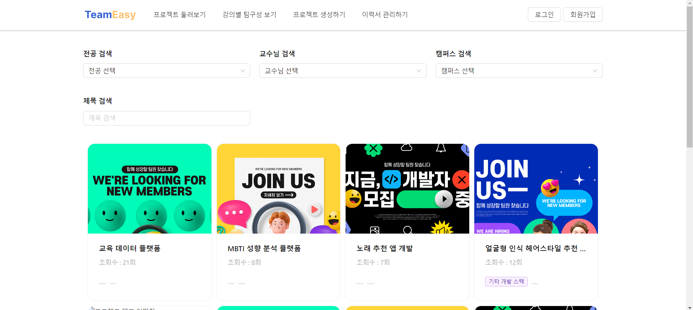
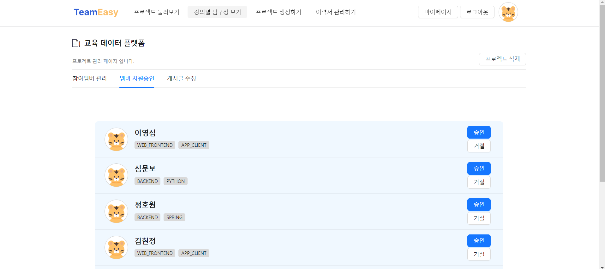
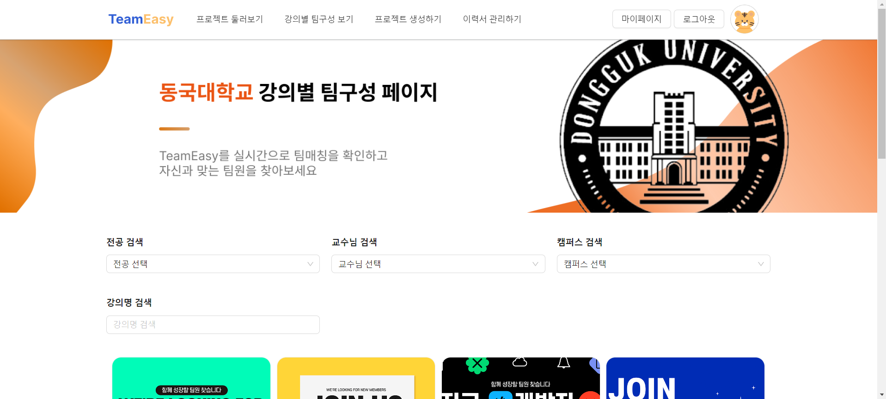
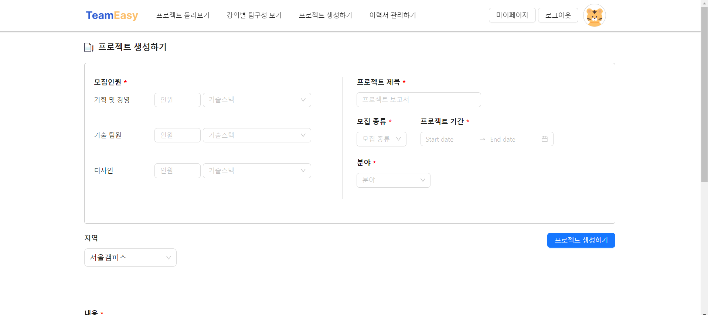
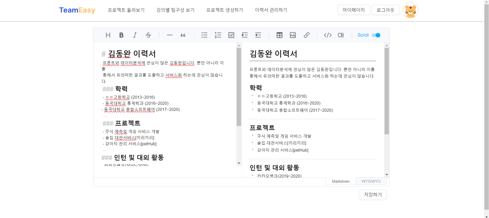
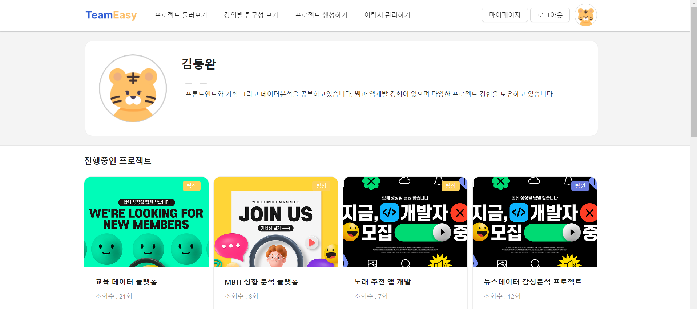

# A4.3 OSS 프로젝트 제품 구성, 배포 및 운영 자료  

- *자료 내용이 길어지는 경우 별도 문서로 작성하고 링크로 연결*

## 1. 프로젝트 제품 구성

- *프로젝트 제품의 구성과 배치 내역을 그림과 글로 설명*  
  
## 2. 프로젝트 제품 배포 방법  


### **배포**
#### **프론트 배포** (AWS Amplify를 이용한 배포)
1. **설치 및 설정**
    - **AWS Amplify 설정**: AWS 콘솔에서 Amplify를 설정하여 프로젝트를 생성하고 GitHub 리포지토리를 연결    
      <br>
      <br>
    - **기본 명령어**: amplify init 명령어를 통해 프로젝트를 초기화하고 설정을 완료

2. **React 프로젝트 배포**
    - **Build 설정**: Amplify 콘솔에서 빌드 설정을 통해 React 프로젝트의 빌드 명령어와 배포 경로를 지정
    - **자동 배포**: GitHub와 연동하여 코드를 푸시할 때마다 자동으로 빌드 및 배포가 진행되도록 설정    
      <br>
3. **배포 중 발생한 문제 및 해결**
    - React 18과 toast-ui의 버전 호환 문제
    - **문제 해결 과정**: React 17로 다운그레이드, 사용하지 않는 변수 삭제 등 여러 시도를 통해 호환성 문제를 해결
    - **최종 해결**: 필요 없는 변수를 제거하고, React 17 환경에서 정상적으로 동작하도록 수정
- 자세한 배포 과정 및 문제 해결 방법
    - <a href="https://velog.io/@naninaniyoyoyoyo/AWS-Amplify%EB%A1%9C-%EB%A6%AC%EC%95%A1%ED%8A%B8-%EB%B0%B0%ED%8F%AC-GitHub-Repository-%ED%99%9C%EC%9A%A9">Amplify로 리액트 배포 (GitHub Repository 활용)</a>
    - <a href ="https://velog.io/@naninaniyoyoyoyo/React-AWS-Amplify-%EB%B0%B0%ED%8F%AC-%EA%B3%BC%EC%A0%95-%EC%A4%91-%EC%97%90%EB%9F%AC-%ED%95%B4%EA%B2%B0">React AWS Amplify 배포 과정 중 에러 해결</a>
#### **백엔드 배포** (AWS Elastic Beanstalk를 이용한 배포)
1.	**Jib 의존성 추가**
      - build.gradle 파일에 Jib 플러그인 추가 및 설정.    
      - 명령어: ./gradlew jib 실행하여 Docker 이미지를 빌드하고 Docker Hub에 푸시.
  ```jib
  plugins {
      id 'com.google.cloud.tools.jib' version '3.2.1'
  }
  
  jib {
      from {
        image = "openjdk:[본인에 맞는 버전]]"
      }
      to {
        image = "[docker hub 이름]/[어플리케이션 이름]"
        tags = ["latest"]
      }
   }
  ```
<br>
2. **docker-compose.yml 파일 생성**
   ```yaml
   version: "3.9"
   services:
   backend:
   image: "[docker hub 이름]/[어플리케이션 이름]:latest"
   ports:
     - "80:8080"
   restart: "always"
   ```
3.	**Elastic Beanstalk 설정**
      - **애플리케이션 생성**: Elastic Beanstalk 콘솔에서 애플리케이션 생성
      - **환경 구성**: Docker 플랫폼 선택    
        <br>
      - **IAM 역할 생성**: EC2와 Elastic Beanstalk 관련 역할 생성 및 필요한 정책 추가
      - **구성 수정**: 생성한 IAM 역할을 Elastic Beanstalk 환경에 할당    
        <br>
      - **배포**: Elastic Beanstalk 콘솔에서 docker-compose.yml 파일을 업로드하여 애플리케이션 배포    
        <br>
- **문제 해결 및 배포 과정**
    - IAM 역할 및 정책 설정 문제 해결
    - Docker 이미지 빌드 및 푸시 과정에서 발생할 수 있는 에러 해결
    - Elastic Beanstalk 환경 구성 및 배포 과정에서 발생할 수 있는 문제 해결

## 3. 프로젝트 제품 운영 방법  

1. 제품 시연을 위한 환경 구성 및 운영방법
- 배포된 사이트를 사용 : <a href = 'https://frontend.d1h9h7iqy0x1qc.amplifyapp.com/'>TeamEasy</a>

2. 제품의 시연 시나리오

제품시연 및 시나리오는 아래 순서대로 진행됩니다. 이번 프로젝트의 주된 기능인 공모전페이지, 강의별페이지, 이력서기능 위주로 시연을 진행하였습니다.

- 링크 : [DevOops 시연영상](https://youtu.be/djW-1r-y7pQ)

1) 로그인
<br>

2) 공모전 프로젝트 둘러보기
<br>

3) 공모전 프로젝트 관리하기
   <br>

4) 강의별 프로젝트 둘러보기
   <br>

5) 프로젝트 생성하기
   <br>
6) 내 이력서 관리하기
   <br>

7) 마이페이지
   <br>
<a href='https://github.com/CSID-DGU/2024-1-OSSProj-DevOops-02'>README 돌아가기</a>