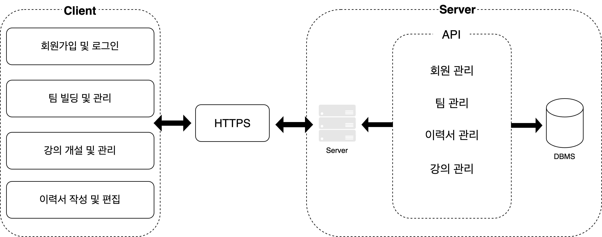

-> 블록 다이어그램 사진

# 파일 구조

Backend

├── gradle/wrapper 
├── review-api 
└── src/main 
└── java/com/example/demo 
├── Main 
├── apiPayload 
├── config 
├── constant 
├── controller 
│ ├── AdminController.java 
│ ├── CourseController.java 
│ ├── HomeController.java 
│ ├── LoginController.java 
│ ├── MainController.java 
│ ├── ProjectController.java 
│ ├── ProjectLikeController.java 
│ ├── StatusController.java 
│ └── UserController.java 
├── domain 
│ ├── Course.java 
│ ├── Project.java 
│ ├── ProjectLike.java 
│ ├── Status.java 
│ └── User.java 
├── dto 
│ ├── CourseDTO.java 
│ ├── LoginDTO.java 
│ ├── ProjectDTO.java 
│ ├── ProjectLikeDTO.java 
│ ├── StatusDTO.java 
│ └── UserDTO.java 
│ └── mapper 
├── repository 
│ ├── CourseRepository.java 
│ ├── ProjectLikeRepository.java 
│ ├── ProjectRepository.java 
│ ├── StatusRepository.java 
│ └── UserRepository.java 
├── response 
├── service 
│ ├── CourseService.java 
│ ├── LoginService.java 
│ ├── ProjectLikeService.java 
│ ├── ProjectService.java 
│ ├── StatusService.java 
│ └── UserService.java 
└── templates 

Frontend

├── public 
└── src 
├── api 
│ ├── base.ts 
│ ├── getMainInfo.ts 
│ ├── getProjectDetails.ts 
│ ├── getProjectList.ts 
│ ├── getUserInfo.ts 
│ ├── getUserProjectManageAply.ts 
│ ├── getUserProjectManageRecommend.ts 
│ ├── getUserprojectList.ts 
│ ├── postProjectCreate.ts 
│ ├── postUpdateUrs.ts 
│ ├── postUserJoin.ts 
│ ├── postUserLogin.ts 
│ ├── postUserLogout.ts 
│ ├── postUserProjectManageHire.ts 
├── assets/images 
├── components 
│ ├── CommonHeader 
│ ├── Display 
│ ├── ManageProjectCard 
│ ├── ProjectCard 
│ ├── ProjectCardDongguk 
│ ├── Question 
│ └── QuestionnaireModal 
├── constants 
│ ├── json 
│ ├── project 
│ └── system 
├── hooks 
├── pages 
│ ├── Admin 
│ ├── Join 
│ ├── Login 
│ ├── Main 
│ ├── Project 
│ ├── Recommend/RecommendUsers 
│ ├── Resume 
│ └── User 
├── styles 
├── types 
├── utils 
│ ├── global.d.ts 
│ ├── index.tsx 
├── .eslintignore 
├── .eslintrc.json 
├── .prettierrc 
├── package-lock.json 
├── package.json 
├── pre-deploy.sh 
└── tsconfig.json 

# 주요 기능별 파일 경로
## Backend 
### 회원가입 및 로그인

#### 구글 로그인

| 파일명                | 역할       | 설명                                              |
|-----------------------|------------|---------------------------------------------------|
| **controller**        |            |                                                   |
| LoginController.java  | Controller | 구글 로그인 관련 사용자 요청을 받아 서비스 메소드 호출 |
| **dto**               |            |                                                   |
| LoginDTO.java         | DTO        | 구글 로그인 관련 데이터 전송 객체                   |
| **service**           |            |                                                   |
| LoginService.java     | Service    | 구글 로그인 관련 비즈니스 로직 구현                |

#### 일반 회원가입 및 로그인

| 파일명                | 역할       | 설명                                              |
|-----------------------|------------|---------------------------------------------------|
| **controller**        |            |                                                   |
| UserController.java   | Controller | 일반 회원가입 및 로그인 관련 사용자 요청을 받아 서비스 메소드 호출 |
| **domain**            |            |                                                   |
| User.java             | Domain     | 일반 회원가입 및 로그인을 위한 사용자 엔티티 클래스   |
| **dto**               |            |                                                   |
| UserDTO.java          | DTO        | 일반 회원가입 및 로그인 관련 데이터 전송 객체        |
| **mapper**            |            |                                                   |
| UserMapper.java       | Mapper     | 일반 회원가입 및 로그인 관련 DTO와 엔티티 간의 변환 담당 |
| **service**           |            |                                                   |
| UserService.java      | Service    | 일반 회원가입 및 로그인 관련 비즈니스 로직 구현      |

### 팀 빌딩 및 관리
| 파일명                        | 역할                                                      | 설명                                                                                      |
|-------------------------------|-----------------------------------------------------------|-------------------------------------------------------------------------------------------|
| **controller**                |                                                           |                                                                                           |
| ProjectController.java        | Controller                                                | 사용자 요청을 받아 서비스 메소드 호출, 프로젝트 생성, 업데이트, 삭제, 조회 등의 작업 수행   |
| **service**                   |                                                           |                                                                                           |
| ProjectService.java           | Service                                                   | 비즈니스 로직 구현, 데이터 접근 레이어와 상호작용                                           |
| **repository**                |                                                           |                                                                                           |
| ProjectRepository.java        | Repository                                                | 데이터베이스와 상호작용, CRUD 작업 수행                                                    |
| **domain**                    |                                                           |                                                                                           |
| Project.java                  | Domain                                                    | 데이터베이스 테이블과 매핑되는 엔티티 클래스                                                |
| **dto**                       |                                                           |                                                                                           |
| ProjectDTO.java               | Data Transfer Object (DTO)                                | Controller와 Service 간 데이터 전송 객체                                                    |
| **mapper**                    |                                                           |                                                                                           |
| ProjectMapper.java            | Mapper                                                    | DTO와 엔티티 간의 변환 담당                                                               |

### 강의 개설 및 관리

| 파일명                | 역할       | 설명                                                      |
|-----------------------|------------|-----------------------------------------------------------|
| **controller**        |            |                                                           |
| CourseController.java | Controller | 사용자 요청을 받아 서비스 메소드 호출, 강의 생성, 업데이트, 삭제, 조회 등의 작업 수행   |
| **domain**            |            |                                                           |
| Course.java           | Domain     | 데이터베이스 테이블과 매핑되는 강의 엔티티 클래스                                          |
| **dto**               |            |                                                           |
| CourseDTO.java        | DTO        | Controller와 Service 간 데이터 전송 객체                                               |
| **mapper**            |            |                                                           |
| CourseMapper.java     | Mapper     | DTO와 엔티티 간의 변환 담당                                                              |
| **repository**        |            |                                                           |
| CourseRepository.java | Repository | 데이터베이스와 상호작용, CRUD 작업 수행                                                  |
| **service**           |            |                                                           |
| CourseService.java    | Service    | 비즈니스 로직 구현, 데이터 접근 레이어와 상호작용                                          |

### 이력서 작성 및 편집

| 파일명                | 역할       | 설명                                                      |
|-----------------------|------------|-----------------------------------------------------------|
| **controller**        |            |                                                           |
| UserController.java   | Controller | 이력서 작성, 수정, 삭제 및 조회 관련 사용자 요청을 받아 서비스 메소드 호출 |
| **domain**            |            |                                                           |
| User.java             | Domain     | 데이터베이스 테이블과 매핑되는 사용자 엔티티 클래스                                         |
| **dto**               |            |                                                           |
| UserDTO.java          | DTO        | Controller와 Service 간 데이터 전송 객체                                               |
| **mapper**            |            |                                                           |
| UserMapper.java       | Mapper     | DTO와 엔티티 간의 변환 담당                                                              |
| **repository**        |            |                                                           |
| UserRepository.java   | Repository | 데이터베이스와 상호작용, CRUD 작업 수행                                                  |
| **service**           |            |                                                           |
| UserService.java      | Service    | 이력서 관련 비즈니스 로직 구현, 데이터 접근 레이어와 상호작용                              |

## Frontend

### 회원가입 및 로그인

| 기능       | 경로                                      |
|------------|-------------------------------------------|
| 회원가입   | frontend/src/pages/Join                   |
| 로그인     | frontend/src/pages/Login                  |

### 팀 빌딩 및 관리

| 기능                         | 경로                                                   |
|------------------------------|--------------------------------------------------------|
| 강의별 프로젝트 메인페이지    | frontend/src/pages/project/ListDongguk                 |
| 강의별 프로젝트 상세페이지    | frontend/src/pages/project/DetailDongguk               |
| 강의별 프로젝트 관리페이지    | frontend/src/pages/user/project/manage                 |

### 강의 개설 및 관리

| 기능         | 경로                                                   |
|--------------|--------------------------------------------------------|
| 강의 개설    | frontend/src/pages/user/project/create                 |
| 강의 개설 관리 | frontend/src/pages/project/user/project/manage          |

### 이력서 작성 및 편집

| 기능        | 경로                                                   |
|-------------|--------------------------------------------------------|
| 이력서 작성 | frontend/src/pages/Resume/createResume                 |
| 이력서 뷰어 | frontend/src/pages/Resume/ViewResume                   |

# 이전 프로젝트 참고 비율

  

    <h3>백엔드</h3>
    

      20%
    

  

  

    <h3>프론트엔드</h3>
    

      70%
    

  

### 참고 레포지토리
[티밍 레포지토리](https://github.com/CSID-DGU/2023-1-OSSP1-colorful-7?tab=readme-ov-file)

# 개발 부분

| 구분         | 백엔드            | 프론트엔드         |
|--------------|---------------------|----------------------|
| **신규 개발**|  구글 로그인        |  강의별 팀 구성 페이지 |
|              |  강의 생성, 수정, 삭제 |  이력서 관리하기 페이지 |
|              |  매칭 상태 확인      |  이력서 확인 페이지   |
| **수정 개발**|  프로젝트 생성, 수정, 삭제 |  프로젝트 세부 페이지  |
|              |  일반 회원가입 / 로그인 |  프로젝트 생성하기 페이지 |
