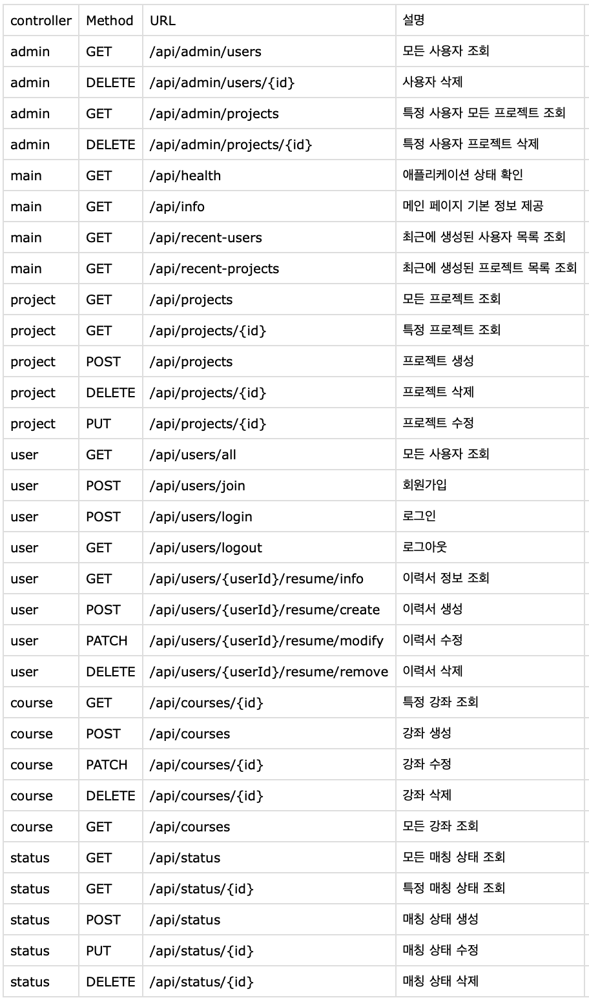
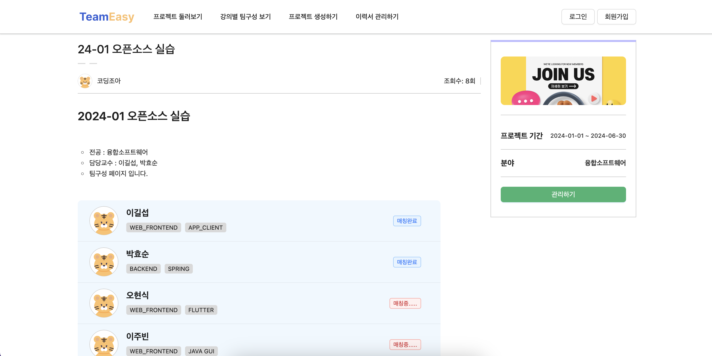
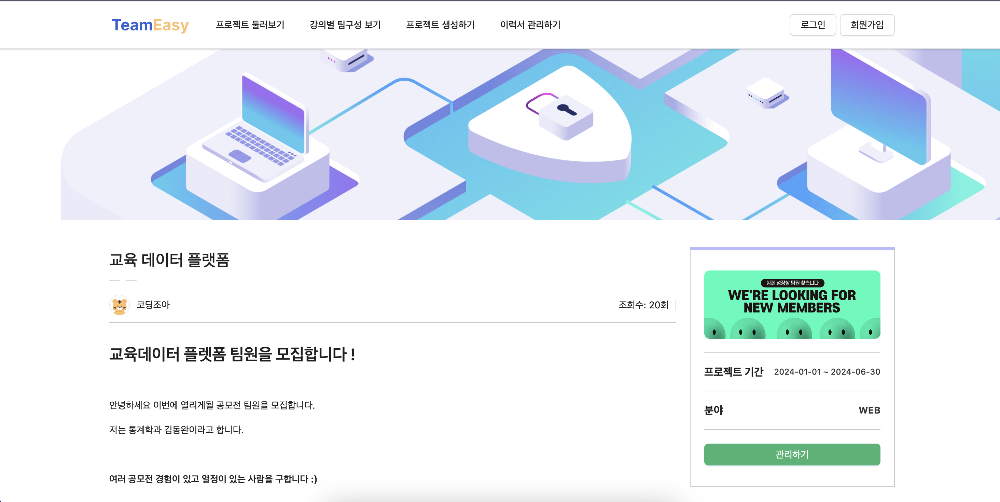

# 2024-1-OSSProj-DevOops-02

* 본 프로젝트는 < <a>https://github.com/CSID-DGU/2023-1-OSSP1-colorful-7?tab=readme-ov-file</a>>프로젝트를 develop한 프로젝트입니다. 프론트 개발 디자인과 코드 스타일을 차용하였습니다.

---
### 0. 팀구성

| 구분 |  성명  |    역할    |     소속학과     |    연계전공    |        이메일        |
|:----:|:------:|:----------:|:----------------:|:--------------:|:--------------------:|
| 팀장 | 천기정 | 기획, 백엔드 개발 | 산업시스템공학과 | 융합소프트웨어 | pridess@dongguk.edu  |
| 팀원 | 김동완 | 백엔드 개발, 배포 | 통계학과         | 융합소프트웨어 | wandong97@dgu.ac.kr  |
| 팀원 | 김호정 | 프론트엔드 개발   | 경영정보학과     | 융합소프트웨어 | 2020111556@dgu.ac.kr | 

### 1. 개발 목표
1. 사용자에게 직관적인 인터페이스를 제공, 팀 빌딩과 프로젝트 관리 과정을 간소화하여 편리함을 제공함으로써 사용자 경험을 강화
2. 학생들에게 타학과 학생들과 교류할 수 있는 서비스를 통해 다양하고 새로운 프로젝트를 진행할 수 있게 효율적인 팀 구성의 기회를 제공
3. 교수님들께 수업 별로 팀 빌딩 과정 및 결과를 실시간으로 제공하여 학생들의 팀 빌딩에 대한 피로도를 감소
4. 동국대학교 이메일을 통한 회원가입 기능을 통해 사용자의 신뢰성을 보장하여 사용자들이 보다 적극적으로 공모전 및 프로젝트에 참여할 수 있게 도움
5. 학생들의 이력서를 통해 자신의 능력을 효과적으로 표현할 수 있도록 도와주어 팀원들이 적합한 팀원을 찾을 수 있도록 도움
6. 학생들이 원하는 프로젝트를 등록하고, 다른 학생들이 참여할 수 있도록 도와주어 학생들이 원하는 프로젝트를 진행할 수 있도록 도움

#### 2. 설계 및 구현
- [**프로젝트 구조**]
     
    
    - Frontend : React.js, TypeScript
    - Backend : Spring Boot
    - Database : MySQL
    - Deploy : AWS , RDS, S3
  
- [**Sequence diagram**]
    - 프로젝트 팀매칭 시퀸스 다이어그램
        
    - 이력서 작성 시퀸스 다이어그램
        
    - 프로젝트 팀 지원 시퀸스 다이어그램
        
- [**ERD**]
    
- [**API명세서**]
    

### 3. 서비스 구현 결과

1. 이력서 작성 페이지
 

   - 학생들은 자신의 이력서를 작성하고, 이를 다른 학생들이 볼 수 있도록 공개할 수 있음
   - 마크다운 형식을 이용하여 자신이 원하는 형식의 이력서를 작성 가능
   - 마크다운이 익숙하지 않은 유저들을 위한 프리뷰 에디터를 제공하여 보다 쉽게 이력서를 작성할 수 있도록 도움
 
2.  동국대학교 강의 페이지
 

   - 교수님은 강의를 등록하고, 학생들은 해당 강의에 참여하여 팀을 구성할 수 있음
   - 강의에 대한 정보와 팀 구성 현황을 확인할 수 있음
   - 강의에 참여 중인 학생들과 이력서를 확인할 수 있음
   - 학생들의 팀 구성 현황을 확인 가능
      
3.  동국대학교 강의 팀구성 페이지
 

   - 학생들은 강의 내에서 자유롭게 팀을 구성할 수 있음
   - 팀원을 찾는 학생들은 자신의 이력서를 등록하고, 다른 학생들의 이력서를 확인하여 적합한 팀원을 찾을 수 있음
   - 가입 상태를 바로 확인 가능
      
4.  동국대학교 팀 매칭 페이지
 
   - 학생들은 자신이 원하는 프로젝트를 등록하고, 다른 학생들이 참여할 수 있도록 도움
   - 원하는 프로젝트의 형식에 맞춰 팀 구성을 변환할 수 있음
   - 팀장은 자신의 이력서와 프로젝트에 대한 정보를 등록할 수 있음
   - 팀원은 자신의 이력서를 통해 가입을 신청할 수 있음

### 4. 기대효과
- **팀 구성 프로젝트를 하는 학생**:
    - **효율적인 팀 구성**
    - **개개인의 능력 발휘**
    - **향상된 학습 경험**
- **교수님**:
    - **간편한 팀 구성 관리**
    - **향상된 프로젝트 퀄리티**
- **공모전과 프로젝트의 퀄리티 향상**
    - **다양한 팀 구성**
    - **성장과 발전**
    - **선의의 경쟁** 

### 5. 실행방법
1. **Frontend 실행 방법**
    - frontend 폴더로 이동
    - `npm install`로 필요한 패키지 설치
    - `npm start`로 실행

2. **Backend 실행 방법**
    - backend 폴더로 이동
    - `./gradlew build`로 빌드
    - `java -jar build/libs/프로젝트명.jar`로 실행

### 6. 자료 관리
#### 제안발표
<a href='https://github.com/CSID-DGU/2024-1-OSSProj-DevOops-02/blob/main/Doc/1_1_OSSProj_02_DevOops_%EC%88%98%ED%96%89%EA%B3%84%ED%9A%8D%EC%84%9C.md'>수행계획서</a> 
<a href='https://github.com/CSID-DGU/2024-1-OSSProj-DevOops-02/blob/main/Doc/1_2_OSSProj_02_DevOops_%EC%88%98%ED%96%89%EA%B3%84%ED%9A%8D%EB%B0%9C%ED%91%9C%EC%9E%90%EB%A3%8C.pdf'>발표자료</a> 

#### 중간발표
<a href='https://github.com/CSID-DGU/2024-1-OSSProj-DevOops-02/blob/main/Doc/2_1_OSSProj_02_DevOops_%EC%A4%91%EA%B0%84%EB%B3%B4%EA%B3%A0%EC%84%9C.md'>중간보고서</a> 
<a href='https://github.com/CSID-DGU/2024-1-OSSProj-DevOops-02/blob/main/Doc/2_2_OSSProj_02_DevOops_%EC%A4%91%EA%B0%84%EB%B0%9C%ED%91%9C%EC%9E%90%EB%A3%8C.pdf'>중간발표자료</a> 

#### 최종발표
<a href='https://github.com/CSID-DGU/2024-1-OSSProj-DevOops-02/blob/main/Doc/3_1_OSSProj_02_DevOops_%EC%B5%9C%EC%A2%85%EB%B3%B4%EA%B3%A0%EC%84%9C.md'>최종보고서</a> 
<a href='https://github.com/CSID-DGU/2024-1-OSSProj-DevOops-02/blob/main/Doc/3_2_OSSProj_02_DevOops_%EC%B5%9C%EC%A2%85%EB%B0%9C%ED%91%9C%EC%9E%90%EB%A3%8C.pdf'>최종발표자료</a> 
<a href='https://github.com/CSID-DGU/2024-1-OSSProj-DevOops-02/blob/main/Doc/4_1_OSSProj_02_DevOops_%EB%B2%94%EC%9C%84_%EC%9D%BC%EC%A0%95_%EC%9D%B4%EC%8A%88%EA%B4%80%EB%A6%AC.md'>최종회의록</a> 
<a href='https://github.com/CSID-DGU/2024-1-OSSProj-DevOops-02/blob/main/Doc/4_2_OSSProj_02_DevOops_%ED%9A%8C%EC%9D%98%EB%A1%9D.md'>범위 및 이슈 관리</a> 